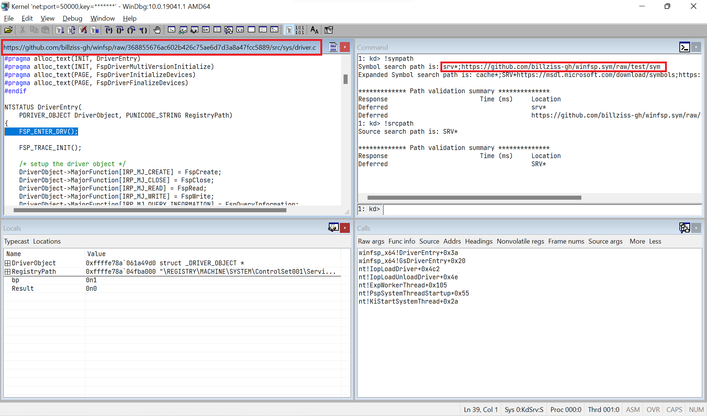

# SymSrv - Use GitHub as a symbol server for Debugging Tools for Windows

This project describes a workflow and contains tools that make it possible to use a Git repository hosting service (e.g. GitHub) as a debugging symbol and source server that is usable by the Debugging Tools for Windows.

## Recommended workflow

### Project setup

In the following we assume that you have a repository `USER/REPO` and that the build process produces debugging symbols in the Microsoft PDB format that you wish to make available publicly for use in WinDbg, Visual Studio, etc.

The recommended setup is to create a new repository named `USER/REPO.sym` that will be used to contain all debugging symbols that you wish to publish. You then add this project (**SymSrv**) as a submodule under `tools`:

```
git submodule add https://github.com/billziss-gh/symsrv.git tools
```

### Symbol publishing

Suppose that the build process of the `USER/REPO` repository places its output products (including debugging symbols) in the `build` subdirectory. We will be publishing those debugging symbols in the `sym` subdirectory of the `USER\REPO.sym` repository using the `symadd.ps1` command.

Here is an example from the [WinFsp](https://github.com/billziss-gh/winfsp) project:

```
billziss@xps:~\Projects\winfsp.sym [test]> .\tools\symadd.ps1 ..\winfsp\build\VStudio\build\Debug\
GitDir: C:\Users\billziss\Projects\winfsp
Origin: https://github.com/billziss-gh/winfsp.git
Commit: 368855676ac602b426c75ae6d7d3a8a47fcc5889
SymDir: C:\Users\billziss\Projects\winfsp.sym\tools\..\sym

Finding ID...  0000000001

SYMSTORE: Number of files stored = 17
SYMSTORE: Number of errors = 0
SYMSTORE: Number of files ignored = 0
```

**NOTE**: By default the `symadd.ps1` utility places symbols either in the `sym` or `..\sym` directory relative to where the utility is located. It checks the directories for existence in order and if neither directory exists it assumes that the `sym` subdirectory is desired. If you are following the recommended project setup and this is the first time using `symadd.ps1`, then the `sym` directory will not exist and `symadd.ps1` will place the symbols under `tools\sym`, which is likely not desirable. To avoid this make sure to execute `mkdir sym` in the root of the `USER\REPO.sym` repository prior to executing `symadd.ps1` for the first time.

The `symadd.ps1` utility will copy the PDB files and will place them in the file hierarchy required by the Debugging Tools for Windows. It will also modify the PDB files to add information directing the Debugging Tools on how to download the correct version of the associated source files directly from the hosting service (e.g. GitHub)!

All that remains is to commit and push the added files using commands such as:

```
git add sym
git commit -m "Release XXX"
git push
```

### Debugging Tools setup

Suppose that symbols have been published in the `USER/REPO.sym` using the process described above. To use the symbols you simply need to add the following path to your debugging symbol path:

```
https://github.com/USER/REPO/raw/BRANCH/sym
```

For example, to enable the symbol and source servers with proper paths in WinDbg:

```
.sympath+ https://github.com/USER/REPO/raw/BRANCH/sym
.srcfix
```

Then upon hitting a breakpoint -- like magic! 🪄🪄🪄



## How it works

The Debugging Tools for Windows have the capability to fetch symbols and sources from a variety of locations including HTTP servers. We exploit the fact that GitHub can serve raw files from a repository using HTTP and we setup our publishing repository in a manner as to be usable by the Debugging Tools.

For this purpose the `symadd.ps1` utility does the following:

- Uses `git` to determine the repository and commit that the PDB files to be published are from.
- Uses the [`symstore`](https://docs.microsoft.com/en-us/windows-hardware/drivers/debugger/symstore-command-line-options) utility to copy the PDB files to be published and place them in the appropriate file hierarchy.
- Uses the [`srctool`](https://docs.microsoft.com/en-us/windows-hardware/drivers/debugger/the-srctool-utility) utility to extract a list of source files referenced by each copied PDB file.
- Cross-references the listed source files with the files tracked by git in the repository where the PDB files cames from.
- Uses the [`pdbstr`](https://docs.microsoft.com/en-us/windows-hardware/drivers/debugger/the-pdbstr-tool) utility to write a special [`srcsrv`](https://docs.microsoft.com/en-us/windows-hardware/drivers/debugger/language-specification-1) stream in each PDB file that contains relocation information for cross-referenced files.

For example, the PDB file `winfsp-x64.sys.pdb` is one of the products of the WinFsp build. Once published it may end up in a location such as `https://github.com/billziss-gh/winfsp.sym/raw/test/sym/winfsp-x64.sys.pdb/177B495A386D458FB3697EE3E3EC04C91/winfsp-x64.sys.pdb`; this is a location that the Debugging Tools know how to find once the symbol path has been set appropriately.

The published PDB file will also contain relocation information for the associated source files, so the source file `C:\Users\billziss\Projects\winfsp\src\sys\driver.c` may be redirected to `https://github.com/billziss-gh/winfsp/raw/368855676ac602b426c75ae6d7d3a8a47fcc5889/src/sys/driver.c`. Notice the use of the commit number to specify the file that ensures that the correct version of the source will be used!

## Requirements

This project requires Git and the Debugging Tools for Windows to be installed. The command line `git` must also be in the `PATH`.

## License

This project is made available under the MIT license.
